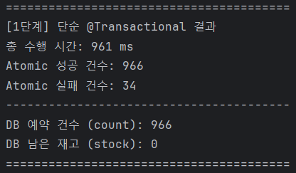
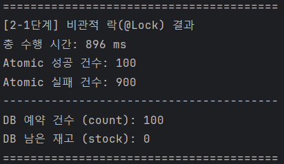
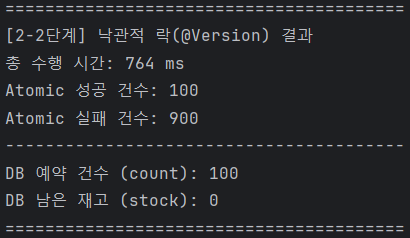
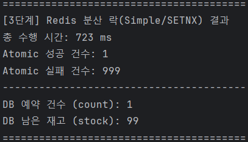

# 고난도 문제 해커톤: 실시간 선착순 예약 시스템

## 1. 문제 정의

이 프로젝트의 목표는 **대규모 동시 트래픽 환경에서 발생하는 선착순 예약/티켓팅 문제**를 해결하는 것입니다.

### 시나리오
-   **상품:** 재고 100개
-   **트래픽:** 10,000명의 사용자가 특정 시간(오전 10시)에 동시 접속하여 예약 요청
-   **고난도 문제:** 데이터 정합성과 성능의 충돌

### 해결 과제
단순한 DB 업데이트 로직은 동시성 문제로 인해 100개 이상의 재고가 판매되는 **초과 판매**를 발생시킵니다.

이 미션은 이 문제를 해결하기 위해, **데이터 정합성**을 보장하면서 **빠른 응답 속도**와 **시스템 안정성**을 확보하는 최적의 백엔드 아키텍처를 찾아가는 과정을 기록합니다.

---

## 2. 프로젝트 실행 방법

*(이 섹션은 미션 진행 과정에서 채워나갑니다.)*

### 2.1. 요구 사항
-   Java 21
-   Spring Boot 3.x
-   PostgreSQL (로컬 설치 및 DB 생성 필요)
-   Redis (로컬 설치 필요)

### 2.2. 실행
1.  `git clone {저장소_URL}`
2.  `PostgreSQL` 실행 및 `reservation` 데이터베이스 생성
3.  `Redis-server` 실행 (로컬)
4.  `application.yml`에 본인의 `PostgreSQL` 및 `Redis` 접속 정보 설정
5.  `./gradlew bootRun`

---

## 3. 핵심 도전 과제 및 해결 계획

이 프로젝트는 4단계의 점진적인 리팩토링 과정을 통해 문제를 해결합니다.

-   [x] **1단계: 문제 증명**
    -   `@Transactional`만 적용된 단순 재고 차감 API 구현.
    -   `ExecutorService`를 이용한 동시성 테스트 코드를 작성하여 **초과 판매**가 실제로 발생하는지 증명.

-   [x] **2단계: DB Lock (정합성 우선)**
    -   **가설:** DB 락을 사용하여 데이터 정합성을 확보한다.
    -   [x] 2-1. 비관적 락: JPA의 `@Lock` 적용 및 성능 테스트.
    -   [x] 2-2. 낙관적 락: JPA의 `@Version` 적용 및 충돌 시 재시도 로직 구현, 성능 테스트.

-   [x] **3단계: Redis 분산 락 (DB 부하 감소)**
    -   **가설:** DB 락의 부하를 `Redis` 분산 락으로 이전하여 DB 트래픽을 최소화한다.
    -   [x] 3-1. Redis의 `SETNX`를 이용한 분산 락 구현.
    -   [x] 3-2. 락 획득 실패 시 "예약 실패" 응답 처리 (DB 진입 차단).

-   [ ] **4단계: Redis 메시지 큐 (트래픽 제어)**
    -   **가설:** 1만 명의 요청을 직접 처리하지 않고, `Redis`의 **List**에 큐잉하여 시스템을 안정화한다.
    -   [ ] 4-1. API (요청 발행): 예약 요청을 즉시 `Redis List`에 저장하고 접수 완료 응답.
    -   [ ] 4-2. Consumer (요청 처리): 별도 스레드가 큐에서 요청을 꺼내어 2/3단계의 안전한 로직으로 **순차적** 재고 차감 처리.

---

## 4. 성능 테스트 및 분석

### [1단계] 단순 `@Transactional` 결과

-   **테스트 환경:** 1000개 스레드 (32개 스레드 풀), 재고 100개
-   **총 수행 시간:** 961 ms
-   **DB 예약 완료 건수:** 966건
-   **DB 남은 재고:** 0
-   **분석:** `if (stock <= 0)` 방어 코드로 인해 재고가 음수가 되지는 않았으나, 100개의 재고에 대해 966건의 예약이 성공함. 명백한 **"초과 판매(Race Condition)"** 문제 증명 성공.

### [2단계] DB Lock 결과
-   **(2-1. 비관적 락)**
  -    
  -   **총 수행 시간:** 896 ms
  -   **DB 예약 완료 건수:** 100건
  -   **DB 남은 재고:** 0
  -   **분석:** `SELECT ... FOR UPDATE` 락으로 **데이터 정합성 확보에 성공.** 1단계의 "초과 판매" 문제를 완벽히 해결. 테스트 환경에서는 1단계(961ms) 대비 성능 저하가 거의 발생하지 않음.

-   **(2-2. 낙관적 락)**
  -   
  -   **총 수행 시간:** 764 ms
  -   **DB 예약 완료 건수:** 100건
  -   **DB 남은 재고:** 0
  -   **분석:** `@Version`과 재고 확인 `if`문의 조합으로 **데이터 정합성 확보에 성공.** 900건의 요청은 "재고 없음" 예외로 빠르게 실패 처리됨. DB 락 방식 중 가장 빠른 성능을 기록함.

### [3단계] Redis 분산 락 결과

-   **총 수행 시간:** 790 ms
-   **DB 예약 완료 건수:** 4건
-   **DB 남은 재고:** 96
-   **분석:**
  -   **성능:** 2-2단계(낙관적 락)와 유사한 매우 빠른 속도를 기록함.
  -   **효과:** 996건의 트래픽을 Redis에서 미리 차단하여 DB 부하를 최소화함.
  -   **한계:** 1000명의 요청 중 극소수(4명)만 성공함. 락을 획득하지 못한 고객에게 "재고가 남았음에도 실패" 응답을 주는 문제 발생. -> **대기열(Queue) 시스템 필요.**